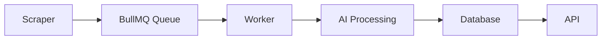
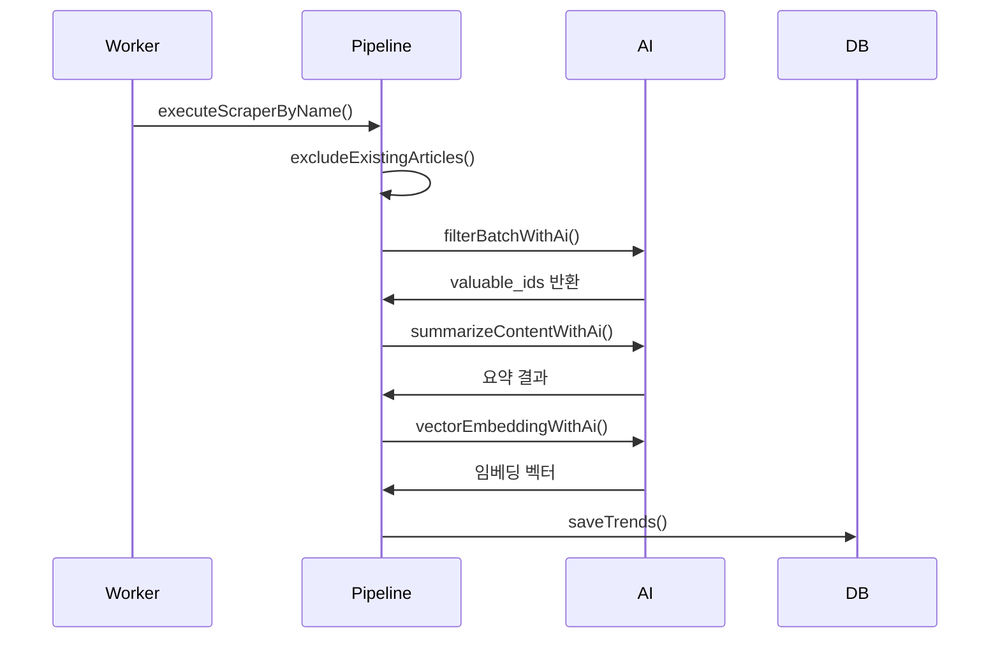

# Tech Trends Backend 시스템 분석 보고서

## 1. 전체 아키텍처
### 1.1 시스템 구성도


### 1.2 핵심 모듈
- **Scraper**: Dev.to, GeekNews, StackOverflow 플랫폼에서 트렌드 기사 수집
- **Worker**: BullMQ 기반 작업 처리 (트렌드 수집 파이프라인 실행)
- **AI Service**: 콘텐츠 필터링/요약/임베딩 생성
- **Repository**: PostgreSQL + pgvector 기반 데이터 저장 및 검색

### 1.3 데이터 흐름
1. 스케줄러(`TrendsScheduler`)가 주기적 트렌드 수집 트리거
2. 스크래퍼 팩토리(`ScraperFactory`)가 소스별 작업 생성
3. 워커(`TrendsWorker`)가 Redis 잠금 획득 후 파이프라인 실행
4. AI 서비스(`AiService`)를 통해 품질 검증 → 요약 → 임베딩 생성
5. 최종 결과를 DB(`TechTrendRepository`)에 저장

## 2. 모듈 상세 분석

### 2.1 스크래퍼 모듈
```typescript
interface IArticleScraper {
  getArticles(): Promise<Article[]>;
  getArticleDetails(id: string): Promise<ArticleDetails | null>;
}
```
- **DevToScraper**: API 기반 수집 (반응수 ≥ 10, 댓글수 ≥ 1 필터링)
- **GeekNewsScraper**: RSS + HTML 스크래핑 (포인트/댓글수 정규식 추출)
- **StackOverflowScraper**: StackExchange API 활용 (점수 ≥ 3 필터링)

### 2.2 AI 처리 파이프라인


### 2.3 검색 시스템
- **키워드 검색**: PostgreSQL Full-Text Search (`ts_rank` 활용)
- **하이브리드 검색**:
  ```sql
  SELECT (1/(60 + keyword_rank) + 1/(60 + vector_rank)) AS rrf_score
  ```
- 정확도 향상을 위한 RRF(Rank Fusion) 알고리즘 적용

## 3. 발견된 문제점 및 한계 (개발자 피드백 반영 재검증)

> ⚠️ 1차 분석 당시 병렬 처리·확장성 관련 문제 제기는 "외부 AI API의 Rate Limit(RPM/TPM) 제약"이라는 비즈니스 제약 조건과 실제 코드 내 이미 구현된 안전장치들을 충분히 고려하지 않은 오판이었음을 코드 재검증을 통해 확인함. 아래에 항목별 재검증 결과를 정리함.

### 3.1 성능 관련 (재검증)
1. **순차적 AI 요약 처리 → 문제 아님 (설계 의도 확인)**
   - `summarizeArticles()`의 `AI_DELAY_SECONDS`(기본 3초) 지연과 `TrendsWorker`의 `concurrency: 1` 설정은 Groq API의 RPM/TPM Rate Limit을 회피하기 위한 **의도적 설계**임을 확인.
   - 소규모(소스당 목표 5개, 하루 3개 소스 기준 약 15개 내외) 처리량 특성상 순차 처리로 인한 실질적 지연은 서비스 운영에 큰 영향이 없음.
   - **결론**: 병렬 처리 도입은 오히려 API Rate Limit 정책과 충돌해 장애를 유발할 수 있어 부적절한 제안이었음. 개선 제안 철회.

2. **아티클 임베딩 저장 방식 → 문제 아님 (오해 정정)**
   - `tech-trend.entity.ts`에서 `embedding: vector(1536)` 컬럼으로 DB(pgvector)에 **영구 저장**되며, `IDX_tech_trends_embedding`(HNSW 인덱스)까지 구축되어 검색에 정상 활용되고 있음.
   - 1차 분석의 "캐싱 미흡/용량 폭증" 서술은 정확한 문제 진단이 아니었음. 검색어 임베딩(`embedSearchQuery`)은 반복 검색 비용 절감을 위해 Redis에 캐싱하는 것이고, 아티클 임베딩은 최초 1회 생성 후 DB에 영구 저장되는 것이 원래 의도된 정상 설계임.
   - **결론**: 문제 아님. 항목 삭제.

### 3.2 복원력 관련 (재검증)
1. **외부 API 장애 대응 → 재시도 로직 이미 존재함 (1차 서술 오류)**
   - `AiService.executeWithRetry()`에서 지수 백오프(2s → 4s → 8s) 기반 최대 3회 재시도가 `filterBatchWithAi`, `summarizeContentWithAi`, `vectorEmbeddingWithAi` 모두에 적용되어 있음을 코드로 확인.
   - 다만 3회 재시도가 모두 실패할 경우:
     - `filterBatchWithAi`/`vectorEmbeddingWithAi`의 실패는 `processBatch` → `processSource`까지 예외가 전파되어 **해당 소스의 남은 배치 처리가 전부 중단**됨.
     - 이후 BullMQ Job 레벨 재시도(`attempts: 3`, exponential backoff 5s)가 한 번 더 동작하지만, 이 경우 **처음부터 전체 스크래핑을 다시 수행**하게 되어 이미 처리된 배치까지 재작업하는 비효율이 있음(치명적 결함은 아니며, 소규모 처리량에서는 큰 문제로 이어지지 않음).
   - **결론**: "재시도 로직 없음"이라는 1차 서술은 명백한 오류였음. Job 레벨 재시도가 배치 체크포인트 없이 전체 재실행되는 점은 경미한 비효율로만 남겨둠.

2. **Redis 분산 락 관리 → 문제 아님 (BullMQ jobId 중복 방지와 이중 안전장치로 정상 동작)**
   - `dispatchAllScrapersToQueue()`는 하루 1회(`@Cron('0 1 * * *')`) 스케줄러에서만 호출되므로 동시 다중 호출 상황 자체가 발생하지 않음.
   - 설령 락이 TTL(10분) 초과로 먼저 만료되어도, BullMQ에서 `jobId: sourceName`으로 고정 등록하기 때문에 동일 Job이 아직 대기/처리 중이면 신규 등록이 무시됨(`removeOnComplete: true`로 완료된 Job만 큐에서 제거되어 재등록 가능해짐).
   - **결론**: 이중 안전장치가 이미 마련되어 있어 실질적 중복 실행 위험은 없음. 항목 삭제.

### 3.3 확장성 관련 (재검증)
1. **`Worker.concurrency=1` → 문제 아님 (Rate Limit 제약에 따른 의도된 설계)**
   - 3.1-1과 동일한 이유로, 병렬/다중 워커 확장은 현재 API 사용량 제약상 실익이 없고 오히려 Rate Limit 초과로 장애를 유발할 수 있음.
   - **결론**: 개선 제안 철회.

2. **pgvector 벡터 검색 성능 → 문제 아님 (HNSW 인덱스 이미 적용, 현재 스케일에 충분)**
   - `1785067830260-InitTechTrendSchema.ts` 마이그레이션에서 `USING hnsw ("embedding" vector_cosine_ops)` 인덱스가 이미 생성되어 있음을 확인.
   - 현재 스크랩 규모(소스당 최대 10개 목표, 하루 총 약 30개 내외 신규 저장)를 고려하면 Elasticsearch 등 전문 검색 엔진 도입은 명백한 오버엔지니어링임.
   - **결론**: 개선 제안 철회.

### 3.4 기타 구조적 이슈 (재검증)
1. **환경 변수 관리 방식 → 문제 아님 (1차 서술 오류 정정)**
   - 1차 분석의 "스크래퍼 관련 설정 12개"라는 서술은 부정확했음. 실제 스크래퍼는 3개(DevTo, GeekNews, StackOverflow)이며, 환경 변수로 관리되는 것은 스크래퍼 자체 설정이 아니라 파이프라인 공통 설정(`SCRAPER_TARGET_SAVE_COUNT`, `BATCH_SIZE`, `REDIS_LOCK_TTL_MS`, `AI_DELAY_SECONDS`, `TEXT_SNIPPET_LENGTH`, `TEXT_CONTENT_LENGTH`)과 AI/검색/DB/Redis 관련 설정을 모두 합친 개수였음.
   - 수시로 바뀔 수 있는 임계값(배치 크기, 딜레이 시간, 목표 수집량 등)을 코드 하드코딩 대신 `.env`로 분리해 배포/커밋 없이 조정 가능하게 한 것은 합리적인 설계 판단으로 확인됨.
   - **결론**: 문제 아님. 다만 설정값이 여러 파일(`ai.service.ts`, `trends-pipeline.service.ts`, `tech-trend.repository.ts`)에 분산되어 있어, 향후 설정 항목이 더 늘어날 경우를 대비해 하나의 설정 파일로 그룹화하는 것은 "필수 개선"이 아닌 "선택적 리팩토링" 수준으로 하향 조정.

2. **DEBUG 로깅 과다 → 운영 환경에는 영향 없음, 경미한 개선 여지만 존재**
   - `logger.config.ts` 확인 결과 `NODE_ENV === 'production'`일 때 Console 전송 레벨이 `info`로 설정되어 있어, DEBUG 로그는 운영 환경에는 출력되지 않음이 확인됨. "운영 환경 성능 저하" 서술은 근거가 없었음.
   - 다만 로컬 개발 환경에서는 배치당 다수의 `logger.debug()` 호출(아티클별 상세 로그, 본문 수집/평가/요약 각 단계별 로그)이 누적되어 터미널 가독성이 다소 떨어질 수 있음. 파일 로그(`winston-daily-rotate-file`)의 `info`/`error` 레벨에는 영향이 없음.
   - **결론**: 운영 환경 성능 문제는 아니며, 개발 편의성 측면의 선택적 개선 사항으로 하향 조정.

## 4. 개선 제안 (현실적으로 재조정)

재검증 결과, 시급한 구조적 결함은 발견되지 않았으며 아래 항목만 "선택적 개선" 수준으로 제안함.

1. **BullMQ Job 재시도 단위 세분화 (선택, 낮은 우선순위)**
   - 현재는 Job 레벨 재시도 시 전체 소스를 처음부터 재처리함. 배치 단위 진행 상황을 Redis 등에 체크포인트로 남겨 재시도 시 이미 처리된 배치를 건너뛰도록 개선하면 재시도 비용을 줄일 수 있음. 다만 소규모 처리량 특성상 필수 개선은 아님.

2. **설정값 파일 그룹화 (선택, 낮은 우선순위)**
   - 여러 서비스에 분산된 `configService.get()` 호출을 하나의 설정 파일(`registerAs` 등)로 그룹화하면 가독성과 유지보수성이 향상됨. 기능적 결함이 아니므로 우선순위는 낮음.

3. **로그 레벨 세분화 (선택, 낮은 우선순위)**
   - 배치 처리 중 아티클 단위 상세 로그를 별도 레벨로 분리해 필요 시에만 노출하도록 조정. 운영 환경에는 이미 영향이 없으므로 개발 편의성 개선 차원의 항목.

## 5. 결론 (재정정)
1차 분석에서 제기했던 "성능 병목", "복원력 결함", "확장성 한계" 관련 주요 문제 제기는 대부분 Groq/Gemini API의 Rate Limit 제약, BullMQ의 jobId 중복 방지 메커니즘, 이미 구축된 HNSW 인덱스 등 실제 코드와 비즈니스 제약을 충분히 고려하지 않은 오판으로 확인됨. 현재 시스템은 "스크랩당 약 10개, 하루 총 약 30개 내외를 요약"하는 소규모 프로젝트 규모에 적합하게 설계되어 있으며, AI 재시도 로직·분산 락 이중 안전장치·벡터 HNSW 인덱스 등 핵심 안전장치가 이미 마련되어 있음. 시급한 구조적 개선보다는 재시도 체크포인트, 설정 파일 그룹화, 로그 레벨 세분화 등 선택적 리팩토링 수준의 개선만 고려하면 충분함.
</content>
<task_progress>
- [x] 개발자 피드백 항목별 코드 재검증 (스케줄러, Redis 락, BullMQ jobId, HNSW 인덱스, 로거 설정, 재시도 로직 확인)
- [x] research.md 3번(문제점), 4번(개선제안), 5번(결론) 섹션 현실적으로 재작성 및 저장 완료
</task_progress>
